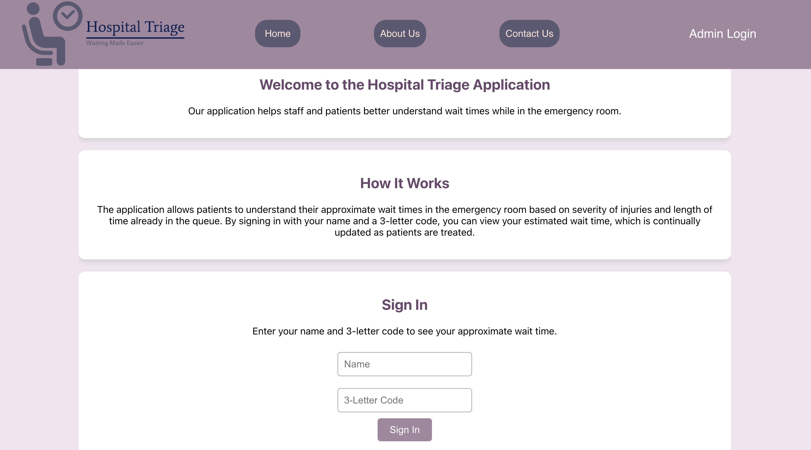
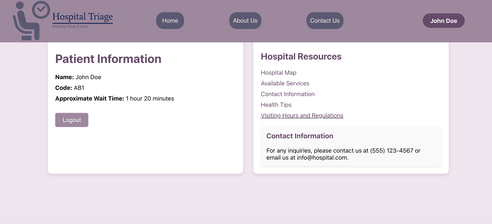
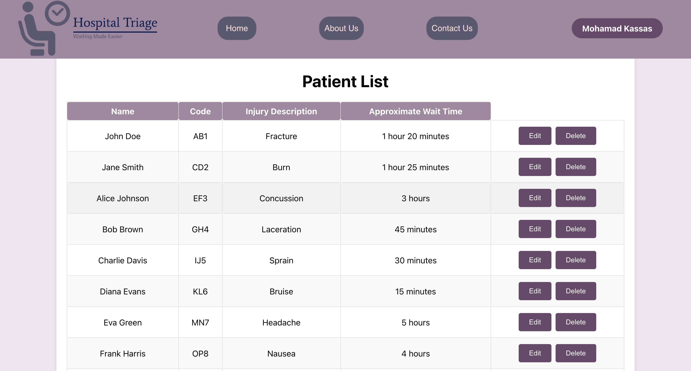
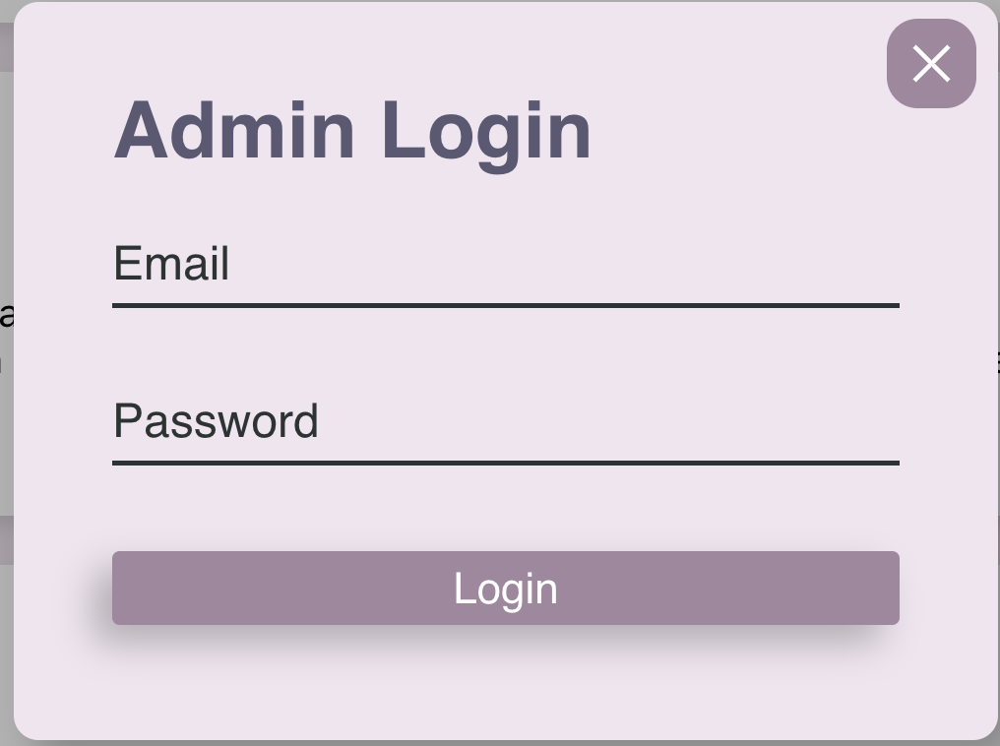

# Design System

This document outlines the design system for the project.

## Fonts

- **Primary Font:** FS Me Regular, sans-serif;

## Colours

- **Primary Colour:** #A1869E (Light Purple)
- **Secondary Colour:** #5C5874 (Dark Purple)
- **Tertiary Colours:** #0B1D51 (Dark Blue)
- **Background Colour:** #ffffff (White)

## Components

### Custom Components

 

#### Landing Page

 

#### Patient Page

 

#### Admin Page

 

### Login Popup

